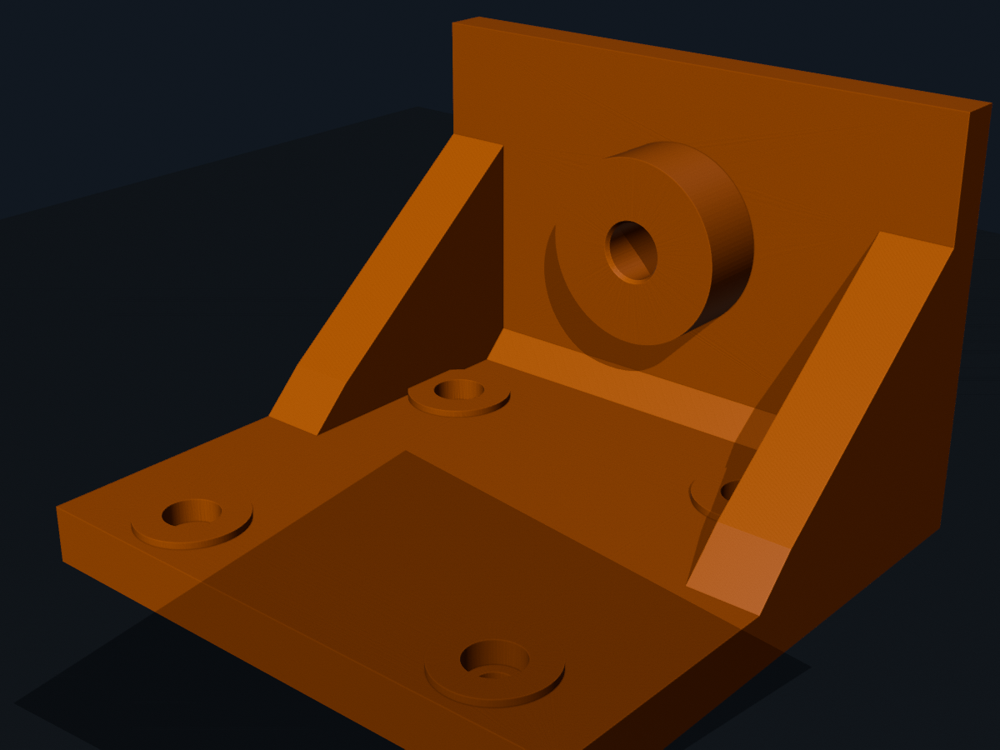
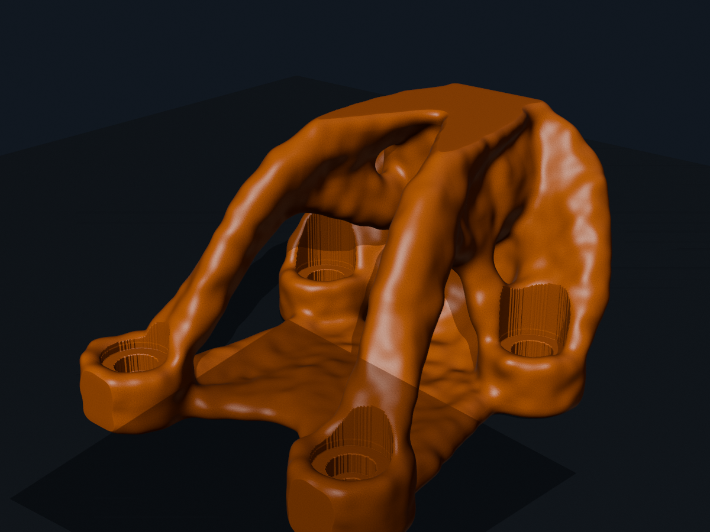
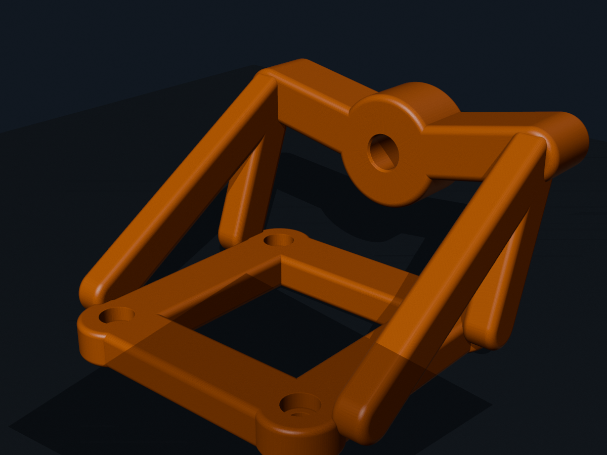
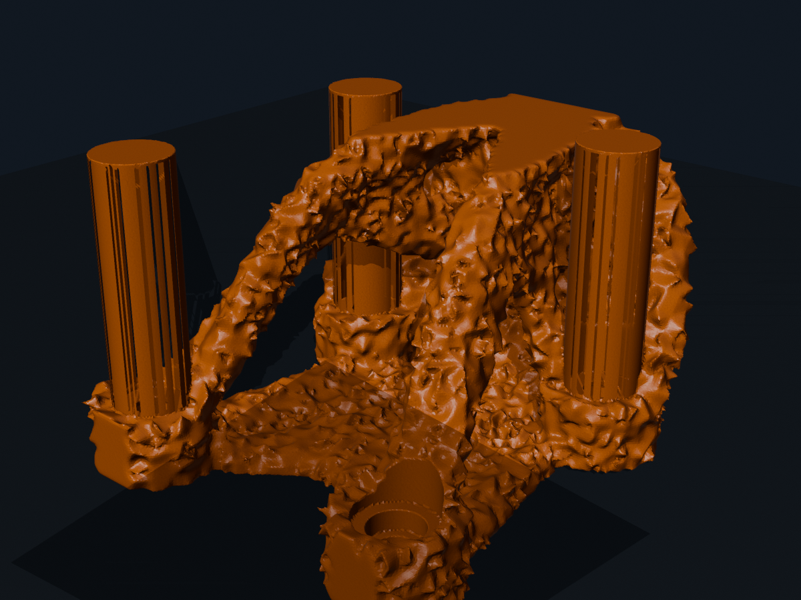
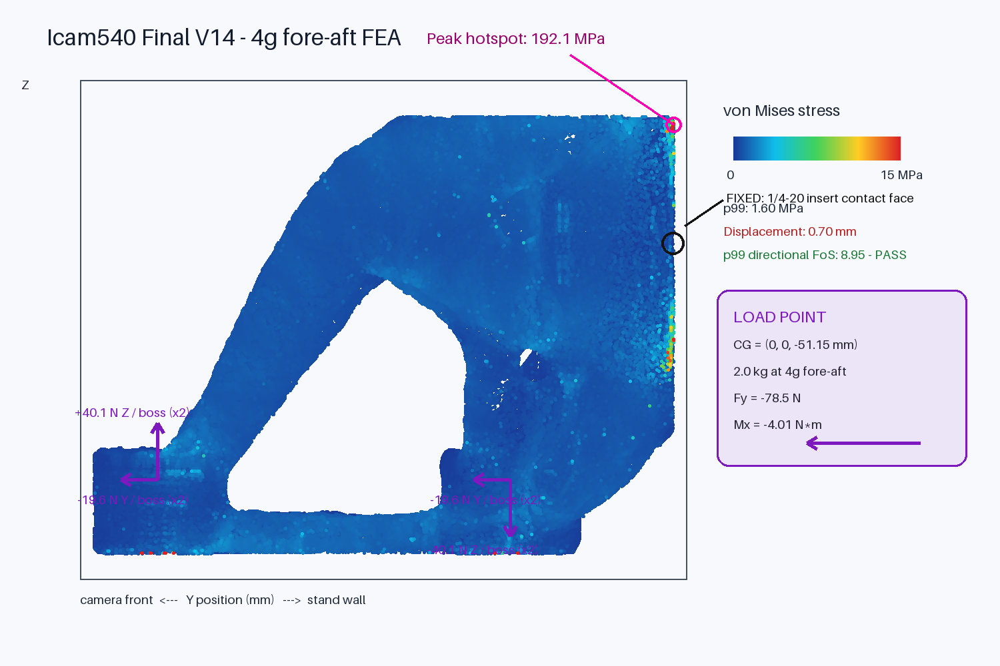
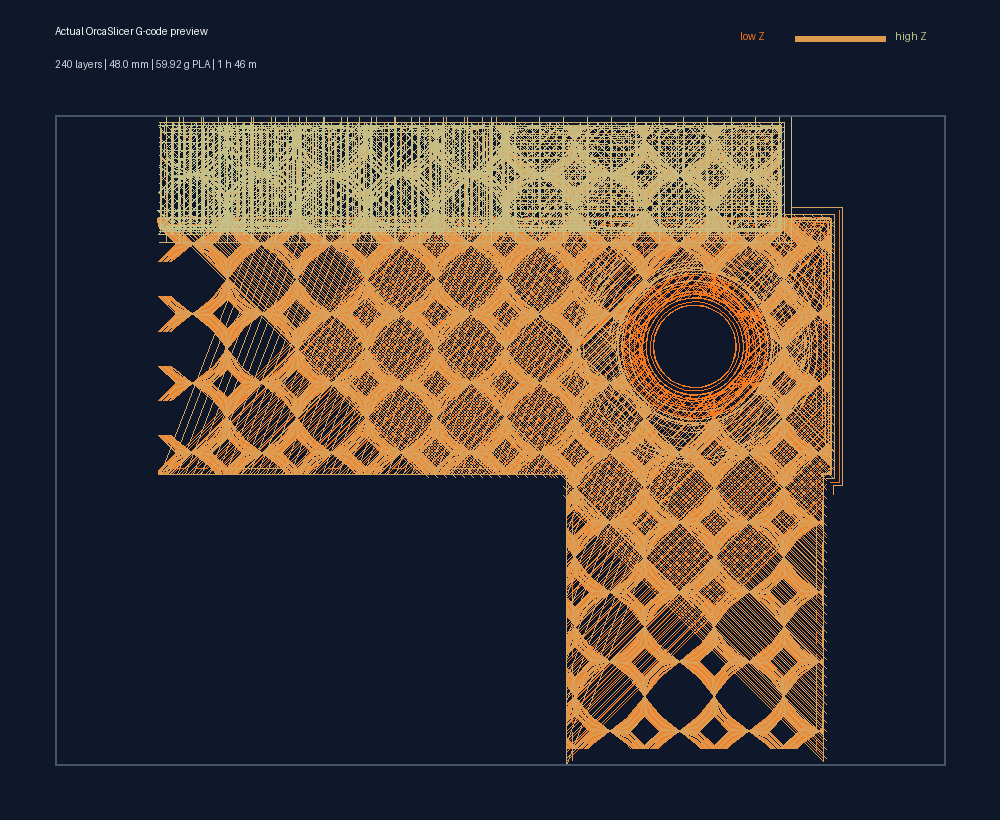

# Topo2STL

A reusable Codex skill for taking topology-optimized FDM structural parts from design-domain definition through BESO, printable reconstruction, independent FEA, slicing, and release evidence.

## Example visual evidence

These are saved checkpoints from one camera-mount development run. They demonstrate the evidence format; every new part must generate and validate its own images and results.

### Before and after

| Conventional ribbed baseline | Final smoothed and interface-restored printable body |
|---|---|
|  |  |

### Optimization progression

| 1. Baseline design | 2. Clean load-path concept |
|---|---|
|  |  |

| 3. Raw reconstructed BESO surface | 4. Smoothed, restored final STL |
|---|---|
|  |  |

The rough third checkpoint is intentionally retained: it shows why smoothing, minimum-thickness recovery, exact hole restoration, and independent final-surface FEA are release gates rather than cosmetic cleanup.

### Final-surface FEA evidence



This example reports the load location, restraints, force distribution, displacement, peak hotspot and robust directional factor of safety in one reviewable image. A displayed hotspot image is supporting evidence, not a substitute for the mesh, solver inputs, convergence check, and full result files.

### Actual sliced toolpath



This top-view toolpath was reconstructed from the generated G-code: 240 layers, 48.0 mm maximum height, 59.92 g PLA and a 1 h 46 m estimate. See the complete [camera-mount evidence example](examples/camera-mount/README.md).

## What it enforces

- Real attachment loads and protected interfaces before optimization
- Explicit user confirmation of payload, center of gravity, restraints, forces, moments, and dynamic load cases
- Optional mirrored-element symmetry during BESO
- Controlled smoothing with exact interface restoration
- Watertightness, connectivity, fit, tooling, and symmetry audits
- Independent print-aware FEA of the final printable surface
- Slicer and physical-test gates before declaring a release printable
- Starting ranges and failure-driven tuning rules for BESO, meshing, reconstruction, interfaces, FEA, and slicing
- Before/after renders, optimization-progress images, convergence plots, FEA hotspots, and slicer evidence

The skill is workflow guidance. It reuses the CAD, BESO, FEA, and slicer tools already present in each project rather than imposing a particular solver.

## Install

Recommended cross-agent installation:

```bash
npx skills add tefj-fun/topo2stl --skill topo2stl -g -a codex
```

Restart Codex if the skill does not appear immediately.

The repository is also a skill-only Codex plugin: `.codex-plugin/plugin.json` exposes the skill under `skills/topo2stl/` with UI metadata and screenshots.

## Use

```text
Use $topo2stl to build or audit this topology-optimized printable part.
```

Project-specific dimensions, loads, material calibration, printer settings, solver commands, and acceptance limits remain in the project being analyzed.

## Project and release contracts

Copy the templates into the project being optimized:

```bash
cp skills/topo2stl/assets/project-config.yaml ./project-config.yaml
cp skills/topo2stl/assets/evidence-manifest.json ./release/evidence-manifest.json
```

Confirm inputs before solving, then validate the final release:

```bash
python skills/topo2stl/scripts/preflight.py ./project-config.yaml
python skills/topo2stl/scripts/validate-release.py ./release/evidence-manifest.json
```

Install the only Python dependency with `python -m pip install -r requirements.txt` when PyYAML is unavailable.

## Safety boundary

Simulation does not replace fit coupons, supervised first prints, proof loading, or inspection for layer-separation and insert failure. The skill requires explicit authorization before uploading to or starting a physical printer.

## License

MIT
